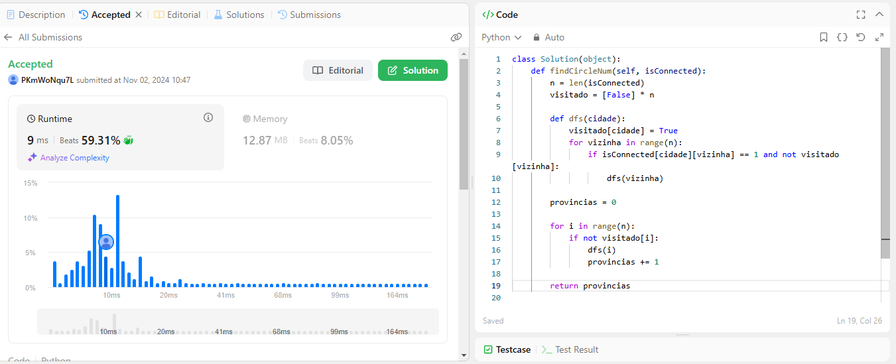
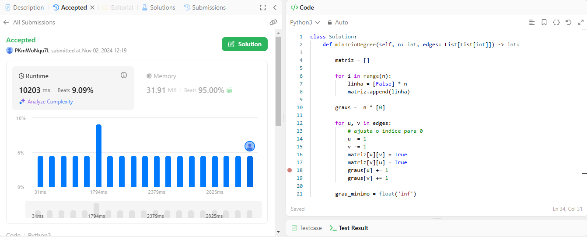

# LeetCode Problems

**Número da Lista**: 1 
**Conteúdo da Disciplina**: Grafos 1 

## Alunos
|Matrícula | Aluno |
| -- | -- |
| 19/0107243  |  Gabriel Pessoa Zaranza |
| 21/1063149  |  Izabella Alves Pereira |

## Sobre 
Este projeto consiste na realização de exercícios da plataforma de juiz eletrônico LeetCode. Serão desenvolvidos problemas de média e alta complexidade, com ênfase nos conteúdos vistos no módulo de Grafos 1.

## Questões 

|Questão | Nível |
| -- | -- |
| [547. Number of Provinces](https://leetcode.com/problems/number-of-provinces/description/)  |  Médio |
| [1761. Minimum Degree of a Connected Trio in a Graph](https://leetcode.com/problems/minimum-degree-of-a-connected-trio-in-a-graph/description/)  |  Difícil |
|   |  Difícil |

## Screenshots

### Problema 547

### Problema 1761

## Instalação 
**Linguagem**: Python 

## Uso 

- Acesse o [LeetCode](https://leetcode.com/).
- Procure pelo problema ou busque pelo ID da questão que será testada.
- Cole o código na área de solução fornecida.
- Clique em "Run Code" para testar com casos de exemplo ou "Submit" para enviar a solução.

## Apresentação

Quaisquer outras informações sobre seu projeto podem ser descritas abaixo.

